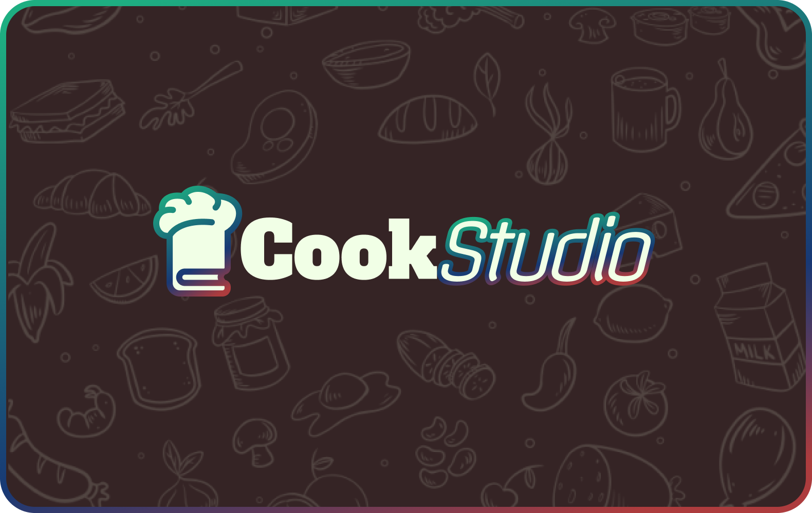

<h1 align="center">CookStudio</h3>

<h3 align="center">Self-hosted Recipe Manager collaborative tool</h3>
 

## Disclaimer
- ⚠️ The project is under **very active** development.
- ⚠️ Expect bugs and breaking changes.

| Planned Features                             |
| :------------------------------------------- |
| Create and manage your recipes               |
| Store your recipes in books                  |
| Plan your week meals with a calendar         |
| Share your recipes and books                 |
| Calculate the ingredients                    |
| Export your recipes in PDF and DOCX          |
| Make a collaborative book or calendar        |
| Quick save a photo of a recipe in drafts     |
| Like and rate your and people's recipes      |
| Filter and search by type, tag or favorites  |
| Personnalize the app your way                |
| Desktop and Mobile app with offline data     |

## Translations
All the text in the app is taken from a single XML file per language, so add your own (or edit it) and add it in index.js
